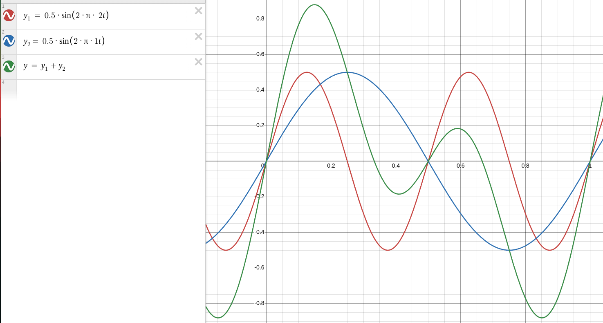

import BevyCanvas from "../../components/BevyCanvas.astro"

The Doppler effect. What is it really? Well you can thank our friend Doppler
for the classic "VroooOOOmm" noise a car makes as it drives passed you. Where the
"Vroo" sounds high pitched as the car approaches, sounds "oO" as it is directly
next to you, and finishes with a low pitch "OOmm" as it drives away from you.
Have you ever wondered why a car does that? I mean when you are in the car,
it's not as if you constantly hear "VroooOOOmm" as you drive passed people on the
side walk.

This article aims to clear up the idea of the Doppler effect so that
we all hopefully have a fairly intuitive understanding of how and why it occurs.

## Perfect Pitch

What is sound? Well, sound is a vibration through the air. Once the vibration
hits your ear, your brain interprets those pressure waves as a noise. Where
pressure waves that vibrate faster are interpreted with a higher pitch, and
slower pressure waves with a lower pitch. The speed of this vibration is known
as a frequency and it turns out that we can listen to a pure frequency wave
(although it sounds awful) however, noises that we encounter in day to day life
are actually combinations, sums, of multiple pure frequency waves. Our friend
[Fourier](https://en.wikipedia.org/wiki/Fourier_series) has quite a bit to say
on this topic, and I am sure I will encounter it again in future articles.

An example of this can be seen below, where the red wave is a 1Hz pure sound,
the blue is a 2Hz pure sound and what you would hear (if you could hear
frequencies that low) would be the green waveform.

This seems off topic but it actually is a key piece of information we need to
understand the Doppler effect. Notice the red wave is much more "squished"
together horizontally than the blue one is. That is because it is at a higher
frequency. So if we bring this back to the idea of a car driving passed, we see
that the wave's we hear (the sound) must go from being more "squished" (higher
frequency) as a car approaches us and transitions to less "squished" (lower
frequency) as the car drives away from us.

## It's All Relative...

This is the exact definition of the Doppler effect. The frequency change that
occurs from motion. In fact more, importantly, relative motion. When you are
sitting in a car, you don't hear the frequency of the engine changing as you
drive along with it. That is because relative to the engine (the noise
transmitter), you are not moving. Even at 100km/h, the position of the engine
relative to you, **never changes** which in turn means the frequency doesn't
change.

So now we have a rough understanding (pun intended) of what the sound wave
is doing as a car travels passed us. Why does the frequency/pitch do that?

Well if we first imagine that a sound wave is a stream of paintballs coming out
of paintball gun, if we aren't moving then we feel the paintballs hit us once a
second. However, if we run directly towards the paintball gun (which is not a
great idea by the way), then we would travel some distance towards the
paintball gun before the next paintball reaches us. This would mean it would
hit us sooner, seeing as it did not need to travel as far. So we may experience
the paintball hitting us once every 0.9 seconds instead of the once a second
previously. Similarly, if we run away from the paintball gun (a very good idea)
then we make the paintball have to travel an extra distance before it hits us.
This would take longer which means we may experience it hitting us once every
1.1 seconds. This is assuming we run at a perfectly regular velocity.

Well the same analogy can be used to think of the frequency changes that happen
due to the Doppler effect. I have made a small animation that shows what I am
referring to below. Imagine that the yellow triangle is a sound transmitter,
and the red is a receiver (your ear) moving towards the sound source, away from
it, or staying still. The red receiver plots a point inside it every time it
hits a sound "particle". (The code that created the Doppler effect animation
can be found [here](https://github.com/James-Rhodes/doppl-rs))

<BevyCanvas id="doppl-rs" script_path="../assets/dopplin-around/doppl-rs.js" alt="An animation of the Doppler Effect"/>

 
Notice that the sound never actually changes
frequency, it is purely the observer who records a change in frequency, either
higher pitch when travelling towards the transmitter or lower pitch when
travelling away.

## What's the Use?

So now that we understand how the Doppler effect works. What can we do with it?

Well it turns out that light also travels as a wave and not only that, it
actually is impacted by the Doppler effect in the same way. Just that rather
than the speed of sound at ~350 metres per second we are talking more like
~300,000 kilometres per second.

Luckily humans have come up with some very clever and very accurate methods of
measuring frequencies. Thanks to our new friend Doppler we also now know that
there is a relationship between measured frequency and relative motion. So by
simply measuring the change in light frequencies from a moving object we can
tell how fast it is moving and whether it is towards us or away from us.

These frequency shifts aren't always appreciated though, in wireless
communication such as Wi-Fi or cellular signals data is sent over channels that
are at very specific frequencies (hand waving a bit here). If you phone
measures that frequency to be different when you hop in a car vs when you are
stationary then it causes some trouble with transmitting data reliably. So your
phone, the Wi-Fi router or the base station you are connected to must account
for these Doppler changes accordingly so that the sent data and the data that
is received is the same.

Some examples of places where the Doppler effect is used include:

- Measuring blood flow in veins or in the heart
- Measuring the motion of planets
- Police speed radar
- Meteorological measurements (storm movements)
- The VroooOOOmm sound a car makes

<pre>

</pre>

---

### Thanks so much for your time and I hope that you enjoyed!
